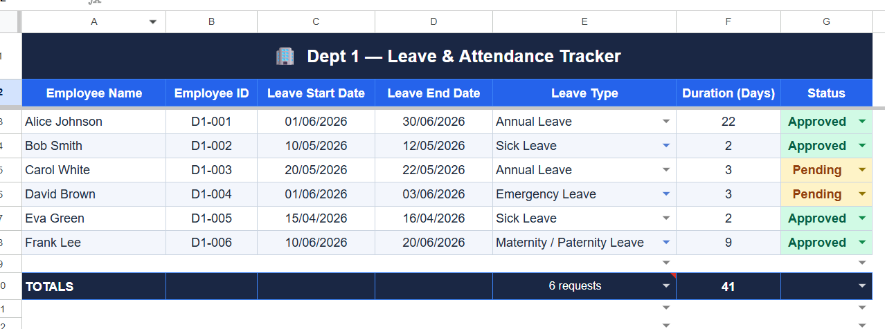

# 📊 HR Leave & Attendance Tracker — Google Sheets

A fully automated HR leave management system built in Google Sheets with Apps Script.

## Features
- 3 department sheets tracking employee leave requests
- Live dashboard with charts and KPIs
- Auto-reject expired pending requests
- Weekly PDF report emailed automatically every Monday
- Configurable settings tab (email, allowances)

## Dashboard Preview

## Department Sheets

**Dept 1**

**Dept 2**

**Dept 3**

## Settings

## Tech Stack
- Google Sheets
- Google Apps Script
- Gmail API (for automated reports)

## How It Works
1. HR staff enter leave requests in each department tab
2. Dashboard auto-calculates totals, pending count, and leave distribution
3. Weekly trigger emails a PDF of the dashboard every Monday at 8 AM
4. Expired pending requests are auto-rejected with one click
4. Expired pending requests are auto-rejected with one click
